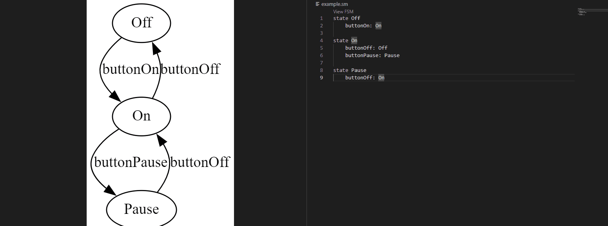
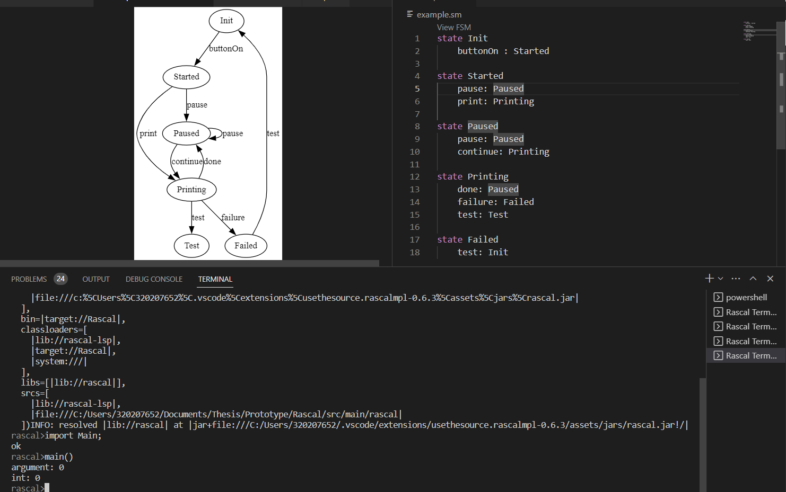

# rascal-ssm

Prerequisite:
* graphviz needs to be installed and on the system path as `dot`
* vs code
* rascal plugin for vs code [plugin](https://marketplace.visualstudio.com/items?itemName=usethesource.rascalmpl)

1. Open src/main/rascal/Main.rsc
2. Scroll down to int main
3. With the plugin installed it should show run in rascal terminal, click on this
4. Rascal terminal should start and we can now open example.sm
5. Click on View FSM to open a FSM view

# Babylon embedded in salix

# Babylon interaction using salix

# Babylon interaction using salix and IDEservices

# Babylon interaction using salix and IDEservices with a urdf 
